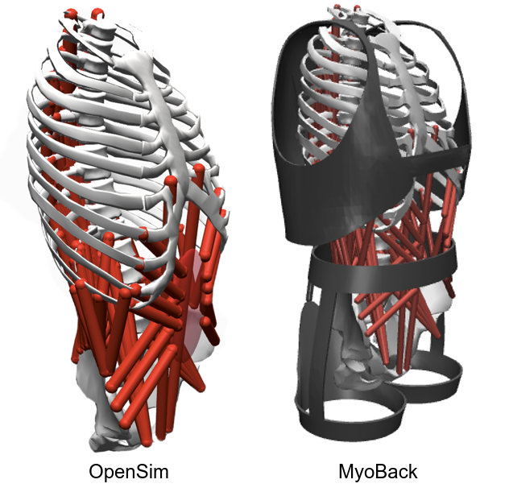

# MyoBack model: Simulation of a neuromusculoskeletal model of the back with an exoskeleton

[Rohan Walia]()<sup>1</sup>,
[Morgane Billot]()<sup>1</sup>,
[Kevin Garzon-Aguirre]()<sup>1</sup>,
[Swathika Subramanian]()<sup>2</sup>,
[Huiyi Wang]()<sup>1</sup>
[Mohamed Irfan Refai]()<sup>2</sup>
[Guillaume Durandau]()<sup>1</sup>

<sup>1</sup>McGill University
<sup>2</sup>University of Twente



## Overview
MyoBack is a human back model part of the MyoSuite framework, derived from a physiologically accurate OpenSim model. MyoBack was validated empirically by integrating a passive back exoskeleton in simulation and comparing forces exerted on the back with values from experimental trials.

MyoBack model can be applied to a range of contexts, including both passive and active exoskeletons, or even to entirely different use cases. To give a basis, we have added an example where a RL agent is trained to control the muscles in the model to balance it and keep it from leaning forward.

The folder [rl_example](./rl_example) includes a sample training script and baseline with which the MyoBack model developed can be tested. Use the instructions below to set up and run the training scripts or load the baseline on your own machine.

## Installation
Install our conda environment on a Linux machine. On Ubuntu 20.04 you need to install the following apt packages for mujoco:
```console
$ sudo apt install -y libosmesa6-dev libgl1-mesa-glx libglfw3 patchelf
```
We recommend [Mambaforge](https://github.com/conda-forge/miniforge#mambaforge) instead of the standard anaconda distribution for faster installation: 
```console
$ mamba env create -f conda_environment.yaml
```
but you can use conda as well: 
```console
$ conda env create -f conda_environment.yaml
```
